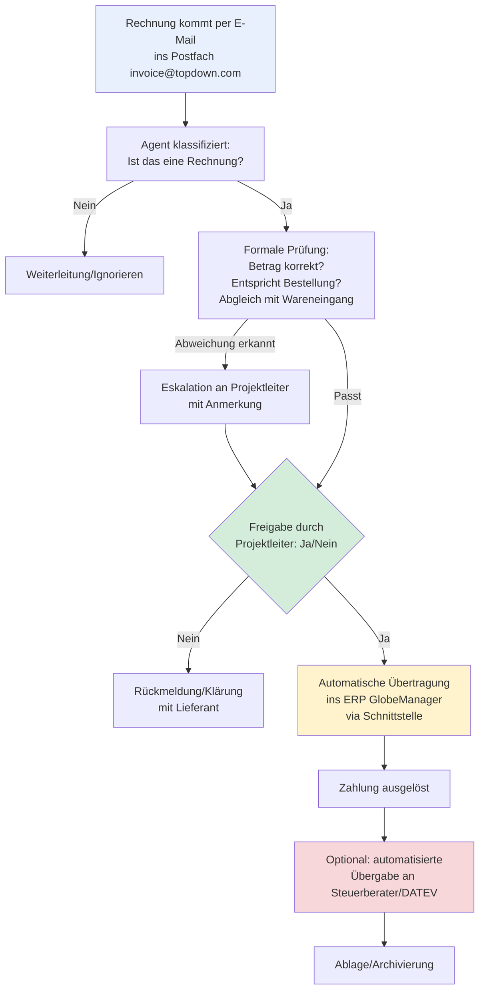

# Prozessia X TopDown – Erstgespräch 11.08.2026

## Firma & Kontakt
- TopDown (topdown-cf.com), Branche: Automobilzulieferer/-dienstleister, TISAX-zertifiziert
- Ansprechpartner: Dominik Nussbaumer (dominik.nussbaumer@topdown-cf.com)
- Unternehmensgröße: laut Dominik "relativ überschaubar" – Transkript bricht an der Stelle ab, bevor eine Mitarbeiterzahl genannt wird

## Ausgangslage: Eingangsrechnungsprozess ("Steinzeit" laut Geschäftsführer)
- Rechnungen kommen klassisch per E-Mail ins Postfach
- Manuelle Erfassung im ERP-System **GlobeManager** (Korrektur Sebastian 11.08.: ursprünglich als "Job Manager"/"Globe Manager" transkribiert – korrekter Name ist GlobeManager)
- Zettel werden ausgedruckt, mit Belegnummern beschriftet, physisch durch Freigaberunde gereicht (Projektleiter prüft, gibt Ja/Nein + Anmerkung, geht zurück)
- Nach Freigabe: Zahlung, danach Ablage für Steuerberater
- Am Monatsende gehen alle Belege + Kontoauszüge gesammelt an den Steuerberater
- Kein eigenes Buchhaltungsprogramm im Einsatz – Plan ist, Daten künftig über **DATEV**-Export bereitzustellen (Schnittstelle hat Prozessia laut Sebastian bereits umgesetzt)
- Wareneingang ist im ERP dokumentiert und muss mit der Rechnung abgeglichen werden können (Parameter-Matching), das sei "der Fall", so Dominik

## Von Sebastian skizzierte Lösung (Beschaffungsagent-Analogie auf Buchhaltung übertragen)
1. Agent überwacht Buchhaltungs-Postfach (Beispiel genannt: invoice@topdown.com)
2. Klassifiziert eingehende Mails als Rechnung
3. Prüft formale Kriterien: Betrag korrekt, entspricht Bestellung, Abgleich mit Wareneingang
4. Überträgt automatisiert und ohne manuellen Zwischenschritt die Daten ins ERP (GlobeManager) via Schnittstelle
5. Optional weiterer Schritt: automatisierte Übergabe an Steuerberater/DATEV
6. Menschliche Freigabe bleibt bewusst im Prozess – Agent macht Vorprüfung, mit der Zeit kann die Prüfquote/Automatisierungsgrad gesteigert werden

## Compliance-Thema (wichtig für TopDown als Automotive/TISAX)
- TopDown hat wegen TISAX-Zertifizierung und Geheimhaltungspflichten in der Automobilbranche KI bisher eher vermieden ("Vermeidung von KI war bisher der Problemlöser")
- Mitarbeiter sind sensibilisiert, aber es gibt noch keine aktive KI-Nutzungsregelung
- Sebastian erklärte: EU AI Act ist seit 2. August 2026 in Kraft, verlangt durchgängige Dokumentation aller KI-Nutzung; Verbot der Eingabe sensibler/personenbezogener/Lieferantendaten in US-Tools (ChatGPT, Claude etc.) wegen Trainingsdaten außerhalb der EU
- Prozessia-Pitch: eigene Agenten sind von Haus aus mit Dokumentationsprozess + datenschutzkonformer Infrastruktur (Azure OpenAI EU) gebaut – TISAX/Geheimhaltung sollte dadurch nicht kollidieren
- Schatten-KI als Risiko genannt: ohne Infrastruktur nutzen Mitarbeiter ohnehin heimlich Tools wie ChatGPT

## Offene Punkte / Stand am Transkriptende
- Sebastian fragte nach Serverinfrastruktur bei TopDown – Antwort "relativ überschaubar" wird nicht mehr vollständig erfasst, Transkript bricht ab
- Kein konkretes Angebot, kein Folgetermin im sichtbaren Transkriptteil vereinbart
- ERP-Schnittstelle GlobeManager noch nicht auf technische Machbarkeit geprüft (API/Dokumentation unbekannt) – müsste vor Angebot geklärt werden

## Prozessvisualisierung: Rechnungsautomatisierung TopDown (Beschaffungsagent-Analogie)

**Kernpunkte des Prozesses:**
1. **Postfach-Überwachung** – Agent liest eingehende Mails an das Rechnungspostfach automatisch mit
2. **Klassifikation** – erkennt, ob es sich überhaupt um eine Rechnung handelt
3. **Formale Prüfung** – Betrag, Bestellbezug, Wareneingangsabgleich (Parameter-Matching, laut Dominik bereits im ERP dokumentiert)
4. **Mensch bleibt im Loop** – Freigaberunde (aktuell Papier/Zettel) wird digital abgebildet, Projektleiter prüft weiter Ja/Nein
5. **ERP-Anbindung** – automatische Übertragung nach Freigabe in GlobeManager statt manueller Erfassung/Ausdruck (technische Machbarkeit noch offen, keine bekannte API-Doku)
6. **DATEV-Anschluss** – optional am Ende der Kette, Schnittstelle hat Prozessia laut Sebastian bereits anderswo umgesetzt

Damit deckt sich der Prozess 1:1 mit dem etablierten Beschaffungsagent-Muster bei Schaufler (Auftragsbestätigung → Abgleich → Eskalation → ERP-Buchung), nur mit Rechnung statt AB als Auslöser.
