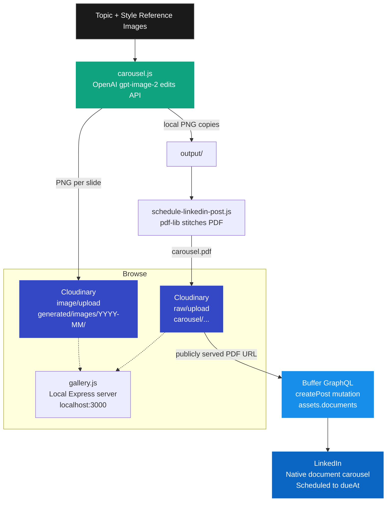

# claude-linkedin-auto-poster

End-to-end pipeline that turns a topic + a few brand reference images into a 6-slide on-brand carousel and schedules it to LinkedIn as a native swipeable document post.

Built around: **OpenAI gpt-image-2** for slide generation, **Cloudinary** for media storage and delivery, **pdf-lib** for stitching the carousel into a PDF, and **Buffer's GraphQL API** for scheduling.

## How it works



## Project layout

| File | Purpose |
|---|---|
| `client.js` | Cloudinary SDK config, loaded by every other script |
| `upload.js` | Generic media upload helper + CLI: `node upload.js <file> [tags...]` |
| `list.js` | List Cloudinary media + CLI: `node list.js --video --tag pool-render` |
| `gallery.js` | Tiny Express server with a thumbnail grid + drag-drop upload (`npm run gallery`) |
| `carousel.js` | Generates a 6-slide carousel via OpenAI `gpt-image-2` (image edits with style refs), uploads each slide to Cloudinary |
| `schedule-linkedin-post.js` | Stitches slides into a PDF, uploads it as a raw asset, and schedules a native LinkedIn document carousel via Buffer's GraphQL API |
| `Style-Guide/` | Brand reference images fed into `gpt-image-2` so generations match the visual identity |

## Setup

```bash
git clone https://github.com/brendanjowett/claude-linkedin-auto-poster.git
cd claude-linkedin-auto-poster
npm install
cp .env.example .env
```

Then fill in `.env`:

| Variable | Where to get it |
|---|---|
| `CLOUDINARY_CLOUD_NAME` / `_API_KEY` / `_API_SECRET` | https://console.cloudinary.com/console |
| `OPENAI_API_KEY` | https://platform.openai.com/api-keys |
| `BUFFER_API_TOKEN` | https://publish.buffer.com/settings/api |
| `LINKEDIN_CHANNEL_ID` | Run a Buffer `channels` GraphQL query (or copy from a published Buffer post URL) |

**One Cloudinary setting to flip:** at https://console.cloudinary.com/settings/security, enable **"Allow delivery of PDF and ZIP files"** — without this, Buffer can't fetch the carousel PDF.

## Usage

### Generate a carousel
```bash
node carousel.js
```
Edit the `TOPIC`, `FOLDER_SLUG`, `STYLE_REFS`, and `slides[]` array at the top of `carousel.js` for each new post. Generates 6 high-quality 1024×1024 slides (~$1 in OpenAI cost), uploads to Cloudinary under `carousel/{folder-slug}/{date}/`, and saves local copies to `output/`.

### Schedule the carousel to LinkedIn
```bash
node schedule-linkedin-post.js
```
Reads the slides from `output/`, stitches them into a single PDF, uploads as raw to Cloudinary, then fires the Buffer `createPost` mutation with the PDF as a document asset. The result is a native LinkedIn document carousel scheduled at `DUE_AT`.

Edit the constants at the top of the file (`POST_TEXT`, `DOC_TITLE`, `THUMBNAIL_URL`, `DUE_AT`) for each post.

### Browse your media
```bash
npm run gallery
```
Opens `http://localhost:3000` with a thumbnail grid filtered by tag, plus drag-drop uploads.

## Notes

- **Native LinkedIn carousels via API:** Buffer's GraphQL API exposes `assets.documents` on `CreatePostInput`, which posts a true swipeable document carousel — *not* a multi-image post. The PDF is the canonical carousel format on LinkedIn.
- **First-comment auto-posting** (the standard "link in comments" trick) requires a paid Buffer plan. On the free plan, drop the link manually when the post publishes.
- **Cloudinary PDF gotcha:** uploading PDFs as `resource_type: 'image'` makes them subject to Cloudinary's PDF/ZIP delivery security setting. This pipeline uses `resource_type: 'raw'` instead, which serves the PDF cleanly with `Content-Type: application/pdf` once the security toggle is enabled.

## License

MIT
